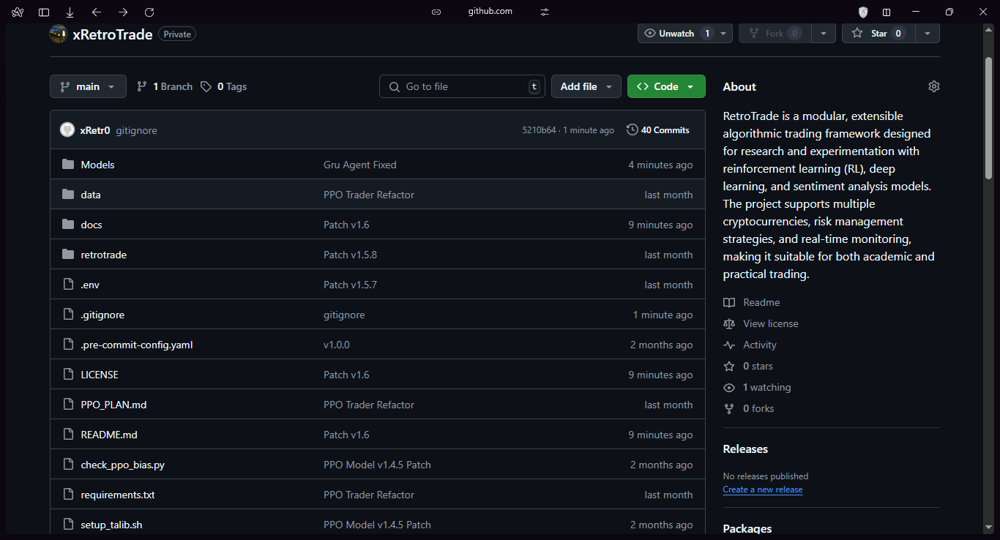

# RetroTrade

RetroTrade is a modular, extensible algorithmic trading framework designed for research and experimentation with reinforcement learning (RL), deep learning, and sentiment analysis models. The project supports multiple cryptocurrencies, risk management strategies, and real-time monitoring, making it suitable for both academic and practical trading system development.

**Note:** This project is not fully complete. Some models are provided as pre-trained and may require further development or fine-tuning.

## Features
- Modular architecture for easy extension and customization
- Support for RL agents (PPO, GRU, GARCH, etc.)
- Sentiment analysis integration
- Risk management modules
- Real-time monitoring and Telegram notifications
- Data processing and symbol discovery
- Pre-trained models included (PPO, GRU, Sentiment, Risk Management)

## Project Structure
```
retrotrade/         # Core trading system modules
Agents/             # RL and ML agent implementations
Models/             # Model definitions and utilities
risk_management/    # Risk management models and scripts
sentiment_analysis/ # Sentiment analysis models and scripts
data/               # Raw and processed market data
PPO_Trader/         # PPO agent implementation and configs
GRU_Model/          # GRU agent implementation and models
```
## 🔍 Project Overview




## Installation
See [docs/Installation.md](docs/Installation.md) for detailed setup instructions.

## Usage
See [docs/Usage.md](docs/Usage.md) for usage examples and module-specific instructions.

## Pre-trained Models
See [docs/PretrainedModels.md](docs/PretrainedModels.md) for information about included pre-trained models.

## Documentation
Full documentation is available in the [docs/](docs/) folder.

## Requirements
- Python 3.8+
- See `requirements.txt` and module-specific requirements files for dependencies.

## License
This project is provided under the [Proprietary License](LICENSE).

## Contact
- Name: Shereef Ibrahim (xRetro)
- Email: shereef225692@ogr.duzce.edu.tr
- GitHub: https://github.com/xRetr00/xRetroTrade

---

**Disclaimer:** This project is for research and educational purposes only. Use at your own risk. Trading cryptocurrencies involves significant risk of loss.
